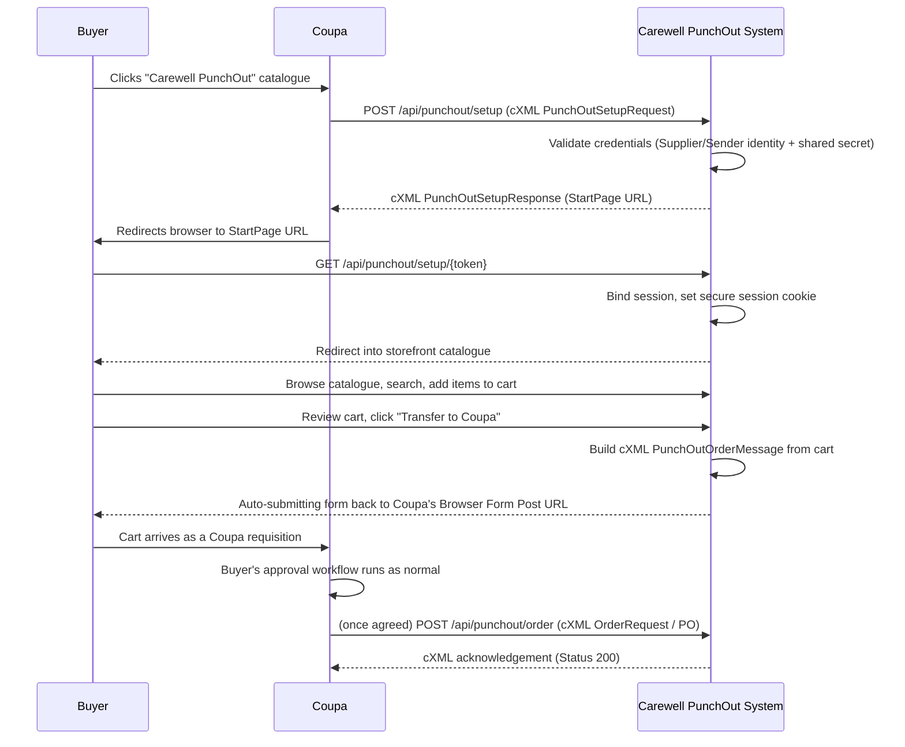

# Carewell Group — PunchOut Catalogue Integration
## System Overview & User Guide

| | |
|---|---|
| **Prepared for** | GPCS (Amazon Business / Coupa procurement team) |
| **Prepared by** | Himanshu Sharma, Technical Project Manager — Carewell Group |
| **Document type** | System overview, credentials reference, and operational guide |
| **Status** | Test / UAT environment live, production go-live pending final sign-off |

---

## 1. Introduction

This document describes the PunchOut catalogue integration built by Carewell Group for GPCS's Coupa procurement platform. It explains, in plain terms, what the system does, how a buyer's shopping session flows end to end, the credentials currently issued for testing, and how our team manages the catalogue and PunchOut configuration day to day.

It is written to be shared directly with the client team so that both sides have one consistent reference for how the integration behaves and how to exercise it.

### 1.1 What is PunchOut?

PunchOut is an industry-standard way for a buying organisation's procurement system (here, Coupa) to send a user out to a supplier's own storefront to shop, and bring their finished cart straight back into Coupa as a requisition — without the buyer ever leaving their normal purchasing workflow or needing separate login credentials for the supplier's site.

The conversation between Coupa and our storefront is carried entirely over **cXML (commerce XML) 1.2**, the protocol Coupa's configuration requires. Everything in this document — the credentials, the URLs, the session handshake — exists to support that protocol correctly.

### 1.2 What this system is (and isn't)

- It **is** a purpose-built PunchOut storefront: catalogue browsing, cart management, and a cXML-driven handoff back to Coupa.
- It **is not** a general online store with a protocol bolted on afterwards — the cXML integration is the core of the product, and the storefront is simply the buyer-facing surface over it.
- Buyers never create an account or log into the storefront directly. The only way into the storefront is through a valid PunchOut session initiated by Coupa (or, for testing, a direct link using the shared secret described below).

---

## 2. Credentials Issued for Testing

The following credentials were issued to GPCS to configure the PunchOut connection on the Coupa side. These identify GPCS's Coupa instance to our system and vice versa, and authenticate every cXML message exchanged.

> **Note:** As this PunchOut integration is developed and hosted entirely on Carewell Group's own platform, no third-party PunchOut network or cXML middleware provider is involved. Our system generates, receives, and validates every cXML message directly.

| Field | Value |
|---|---|
| **Supplier Identity** | `748499849` |
| **Supplier Domain** | `DUNS` |
| **Sender Identity** | `748499849` |
| **Sender Domain** | `DUNS` |
| **Shared Secret** | `CWG-PUNCHOUT-2026-ELSYVOOGQW` |
| **Protocol** | cXML |
| **PunchOut Catalog URL (Prod)** | `https://punchout.carewellgroup.com.au/storefront` |
| **PO Transmission URL (Prod)** | `https://punchout.carewellgroup.com.au/admin/punchout-preview/complete` |

The Sender Identity was issued as identical to the Supplier Identity at GPCS's request, so both directions of the handshake authenticate against the same DUNS-based identity.

> **On the PO Transmission URL:** the URL above is currently the same endpoint our team uses internally to preview and verify a completed cart transfer. The final production channel for returning an approved Purchase Order to Carewell (cXML `OrderRequest`, CSV, or email) is still being confirmed with GPCS. Once agreed, live POs will be received at our dedicated cXML endpoint (`/api/punchout/order`) rather than the preview URL, and this document will be updated accordingly.

### 2.1 Live/Test Access Link

To make it possible to test the full storefront and transfer experience **without** requiring a full cXML round trip from Coupa, our system supports opening the storefront directly using the shared secret as a one-time entry token:

```
https://punchout.carewellgroup.com.au/api/punchout/setup/CWG-PUNCHOUT-2026-ELSYVOOGQW
```

Opening this link in a browser:

1. Authenticates the shared secret against the active credential on file.
2. Starts a genuine PunchOut session, identical in every way to one Coupa would have started via cXML.
3. Redirects into the storefront catalogue, ready to browse and add items to a cart.

This is the fastest way for the GPCS team to see the live storefront experience today, and is safe to use repeatedly — each visit starts a fresh session.

---

## 3. End-to-End Flow

The diagram below describes what happens from the moment a buyer clicks "Punch-In" inside Coupa through to their requisition being created.



### 3.1 Step-by-step, in plain terms

1. **Buyer starts shopping.** From inside Coupa, the buyer selects the Carewell Group PunchOut catalogue.
2. **Coupa calls our system.** Coupa sends a `PunchOutSetupRequest` (cXML) to `POST /api/punchout/setup`, carrying the buyer's identity and the credentials above.
3. **We validate and open a session.** Our system checks the Supplier/Sender identity and shared secret, creates a time-bound PunchOut session, and replies with a `StartPage` URL pointing back into our storefront.
4. **Buyer lands in the storefront.** Coupa redirects the buyer's browser to that URL. We bind their session (secure, `SameSite=None` cookie so it survives Coupa's embedded frame), and take them straight to the catalogue.
5. **Buyer shops.** They can search or browse by category, view full product detail pages (description, pricing, pack size, lead time, stock status), and build a cart — all without ever logging in.
6. **Buyer reviews and transfers their cart.** From the cart review page, clicking "Transfer to Coupa" builds a `PunchOutOrderMessage` (cXML) representing every line in the cart with current, live-resolved pricing, and automatically posts it back to Coupa's registered return URL. The buyer sees this happen as a normal page transition — no manual copy/paste, no separate download.
7. **The cart becomes a Coupa requisition.** From this point, Coupa's own approval workflow takes over exactly as it does for any other requisition.
8. **(Once the channel is confirmed) The Purchase Order comes back to us.** After approval, Coupa can transmit the finalised PO back to our `/api/punchout/order` endpoint as a cXML `OrderRequest`. We validate it, store it, deduct stock, and send Coupa a same-session cXML acknowledgement.

---

## 4. Testing the Flow Without Coupa

Two options exist for exercising the system independently of a live Coupa environment:

1. **The direct test link** in [Section 2.1](#21-livetest-access-link) — the simplest option, usable by anyone including non-technical reviewers.
2. **The Admin "Test Token Generator"** (`Admin panel → Punchout → Test Token Generator`) — lets our team generate a fresh preview session against any configured credential (Test or Production), see it listed with a creation/expiry time, open it in a new tab, or revoke it early. This is what our team uses internally to verify catalogue changes before they reach a live buyer.

Either path exercises the real storefront and, if clicked all the way through to "Transfer to Coupa," the real cart-to-cXML logic — the only difference is that a preview session's "return to Coupa" step lands on our own internal review page (showing the exact cXML that would have been sent) rather than a real Coupa requisition screen.

---

## 5. Managing the Product Catalogue

Our team maintains the catalogue through a dedicated Admin panel at:

```
https://punchout.carewellgroup.com.au/admin
```

### 5.1 Adding or editing a single product

`Admin → Catalogue → Products → New Product`. Each product record carries:

| Section | Fields |
|---|---|
| **Identity** | SKU, Supplier Part ID (the exact value sent on the cXML `SupplierPartID` element), optional auxiliary/manufacturer part ID and manufacturer name |
| **Description** | Product name, short description, optional long description, category |
| **Classification & units** | UNSPSC code (8 digits), unit of measure (e.g. `EA`, `BX`, `CS`), pack size (leave blank if not sold in packs), lead time in days |
| **Inventory** | Stock on hand — deducted automatically as POs are received; a negative value tells us how many extra units need restocking |
| **Pricing** | List price and currency |
| **Media & status** | Product image (uploaded directly, image editor built in), active/inactive toggle |

Products can be activated or deactivated instantly — an inactive product simply stops appearing in the storefront without needing to be deleted.

### 5.2 Bulk-loading the catalogue

For loading many products at once, the **Import** button on the Products page accepts a CSV or Excel (`.xlsx`/`.xls`) file with the following columns (order doesn't matter):

```
sku, supplier_part_id, supplier_part_auxiliary_id, manufacturer_part_id,
manufacturer_name, name, description, long_description, category,
unspsc_code, unit_of_measure, pack_size, lead_time_days, list_price,
currency, image_path
```

Only `sku`, `name`, `unspsc_code`, `unit_of_measure`, `list_price`, and `currency` are mandatory — everything else is optional. Re-importing a file with an existing SKU updates that product rather than duplicating it, and any row with a problem (missing required column, invalid UNSPSC code, etc.) is skipped with a clear reason rather than failing the whole import.

### 5.3 Categories and contract pricing

Categories (`Admin → Catalogue → Categories`) organise the storefront's browse/search experience and can be nested. Contract pricing (`Admin → Catalogue → Contract Prices`) lets a product carry a time-bound price that overrides its list price for a given date range — used for negotiated or promotional pricing without needing to edit the product record itself.

---

## 6. Managing PunchOut Credentials & Sessions

`Admin → Punchout → Punchout Credentials` is where every buyer connection — test or production — is configured. This is deliberately the **only** place these values are set; they are never hard-coded or stored in a config file, so onboarding a new buyer identity or rotating a secret is a configuration change, not a deployment.

Each credential record holds:

- **Environment** — Test or Production
- **Buyer domain/identity (From)** and **Buyer domain/identity (To)** — how Coupa identifies itself and us in the cXML `Header`
- **Sender domain/identity** — the identity actually authenticating the request
- **Return URL** (`browser_form_post_url`) — where a transferred cart is posted back to on Coupa's side
- **Shared secret** — write-only by design: it is never redisplayed after saving, and a one-click **Generate** button produces a new random 64-character value. Leaving it blank while editing keeps the existing secret unchanged.
- **Active/Revoked** status — a credential can be revoked instantly (with confirmation), immediately stopping that buyer identity from authenticating, and reactivated just as easily.

This is also where the shared secret in Section 2 lives operationally: rotating it here takes effect on the very next request, with no code change or redeploy required.

---

## 7. Security Notes

- The storefront session cookie is set `Secure`, `HttpOnly`, `SameSite=None`, and `Partitioned` — required for the session to survive being embedded inside Coupa's iframe, while still preventing script or cross-site access to it.
- Every cXML endpoint (`/api/punchout/setup`, `/api/punchout/order`) validates the Supplier/Sender identity and shared secret on every single request — there is no session-based trust on these raw XML endpoints.
- Every inbound and outbound cXML message is logged (`punchout_logs`) before any parsing is attempted, so a malformed or unexpected payload is never silently lost, and is automatically pruned after a configurable retention window.
- The shared secret is treated as a credential, not a password to remember: it is write-only in the Admin UI and only ever shown once, at generation time.
- All PunchOut traffic runs over HTTPS end to end.

---

## 8. Reference: Key URLs

| Purpose | URL |
|---|---|
| Storefront (catalogue entry point) | `https://punchout.carewellgroup.com.au/storefront` |
| cXML Setup endpoint (Coupa → Carewell) | `https://punchout.carewellgroup.com.au/api/punchout/setup` |
| cXML Order Request endpoint (Coupa → Carewell, pending final confirmation) | `https://punchout.carewellgroup.com.au/api/punchout/order` |
| Direct test/live entry link | `https://punchout.carewellgroup.com.au/api/punchout/setup/CWG-PUNCHOUT-2026-ELSYVOOGQW` |
| Admin panel | `https://punchout.carewellgroup.com.au/admin` |

---

## 9. Open Items

For full transparency with the client team, the following points are still being finalised and will be updated in this document once confirmed with GPCS:

- **PO transmission channel** — whether the approved Purchase Order is returned to Carewell via cXML `OrderRequest`, CSV, or email.
- **Contract pricing scope** — whether pricing needs to vary by buyer, business unit, or country, or a single contract catalogue is sufficient.
- **Production go-live date** — pending final sign-off from GPCS on the flow described above.

---

## 10. Contact

For any questions on this integration, environment access, or credential changes, please reach out directly:

**Himanshu Sharma**
Technical Project Manager, Carewell Group

---
*This document reflects the system as implemented and tested as of the date of issue. Values in Section 2 are test/UAT credentials issued for integration verification and are not intended for distribution beyond the GPCS integration team.*
